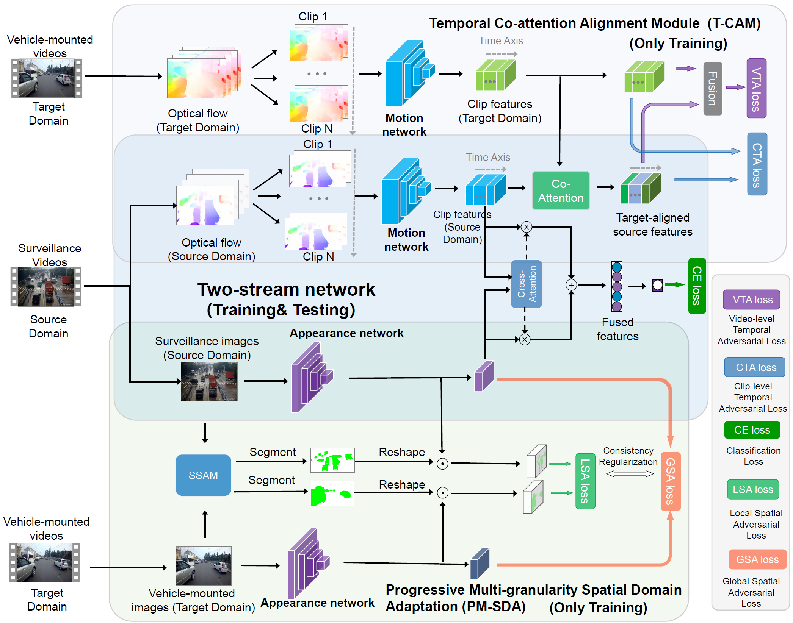

# Bridging Cross-View Gaps: A Spatial-Temporal Attentive Domain Adaptation Framework for View-Robust Traffic Accident Detection

[]()

## Abstract

Video-based traffic accident detection has emerged as a key technology for traffic emergency response. However, existing methods are typically designed for specific viewpoints, leading to limited cross-view generalization capability. A unified accident detection system that works robustly across different viewpoints is crucial for cost-effective deployment. To this end, this paper proposes a spatial-temporal attentive domain adaptation framework for view-robust accident detection, addressing three main challenges in cross-view accident representation learning, i.e., appearance variations, temporal misalignment, and background interference. Specifically, we propose: (1) a progressive multi-granularity spatial domain adaptation method to handle viewpoint-induced appearance variations, (2) a temporal co-attention module for cross-view temporal alignment, and (3) a comprehensive contrastive learning approach with background suppression to enhance noise-robust motion feature learning. Experiments demonstrate significant improvements across various cross-view transfer settings, notably achieving a 13.88% F1-score improvement in the "Vehicle-mounted→UAV" transfer scenario, providing a practical solution for unified multi-viewpoint accident detection.



## Method Overview

To address cross-view traffic accident detection challenges, we propose a novel two-stream framework with two core components: **Progressive Multi-granularity Spatial Domain Adaptation (PM-SDA)** and **Temporal Co-attention Alignment Module (T-CAM)**. 

- **PM-SDA** performs global and local feature alignment using SSAM for accident region localization and minimum entropy regularization for transferable region localization
- **T-CAM** addresses temporal misalignment through cross-domain clip correlation
- The framework is further enhanced by **Comprehensive Contrastive Learning (CCL)** strategies—Background Suppression (BS), Temporal Discrimination (TD), and Modal Matching (MM)—to improve feature discrimination and suppress background interference.

## Key Highlights

- ✨ **13.88% F1-score improvement** in Vehicle-mounted→UAV transfer scenario
- 🚀 **State-of-the-art performance** across multiple cross-view transfer settings
- 🎯 **Unified framework** for robust multi-viewpoint accident detection
- 📊 **Comprehensive evaluation** on three viewpoint types: Surveillance, Vehicle-mounted, UAV

## Experimental Results

### Baseline Cross-View Transfer Performance

| ID | Training→Testing | P(%) | R(%) | FAR(%) | MR(%) | F1(%) |
|:--:|:-----------------|:----:|:----:|:------:|:-----:|:-----:|
| 1  | Surveillance→Surveillance | 76.70 | 77.78 | 20.72 | 22.22 | **77.23** |
| 2  | Surveillance→UAV | 67.61 | 71.34 | 26.69 | 28.66 | 69.43 |
| 3  | Surveillance→Vehicle-mounted | 60.90 | 62.73 | 33.89 | 37.27 | 61.80 |
| 4  | Vehicle-mounted→Vehicle-mounted | 76.66 | 78.70 | 20.17 | 21.30 | **77.67** |
| 5  | Vehicle-mounted→Surveillance | 60.10 | 64.42 | 37.48 | 35.58 | 62.19 |
| 6  | Vehicle-mounted→UAV | 52.58 | 57.76 | 40.68 | 42.24 | 55.05 |
| 7  | UAV→UAV | 72.27 | 77.01 | 23.08 | 22.99 | **74.57** |
| 8  | UAV→Surveillance | 66.80 | 68.78 | 29.96 | 31.22 | 67.78 |
| 9  | UAV→Vehicle-mounted | 54.42 | 59.40 | 41.88 | 40.60 | 56.80 |
| 10 | Joint-view→UAV | 68.46 | 73.88 | 26.57 | 26.12 | **71.07** |
| 11 | Joint-view→Vehicle-mounted | 73.64 | 76.71 | 23.11 | 23.29 | **75.14** |
| 12 | Joint-view→Surveillance | 74.51 | 75.25 | 22.56 | 24.75 | **74.88** |

### Comparison with State-of-the-Art Methods

#### Vehicle-mounted → UAV Transfer

| Method | P(%) | R(%) | FAR(%) | MR(%) | F1(%) | AUC(%) |
|:-------|:----:|:----:|:------:|:-----:|:-----:|:------:|
| TA3N (ICCV'19) | 56.87 | 62.39 | 36.95 | 37.61 | 59.50 | 68.83 |
| SAVA (ECCV'20) | 58.49 | 63.73 | 35.31 | 36.27 | 61.00 | 73.08 |
| MM-SADA (CVPR'20) | 56.13 | 60.15 | 36.71 | 39.85 | 58.07 | 70.64 |
| CMCDCL (ICCV'21) | 61.26 | 68.21 | 33.68 | 31.79 | 64.55 | 73.71 |
| STCDA (CVPR'21) | 63.23 | 67.76 | 30.77 | 32.24 | 65.42 | 76.08 |
| CIA (CVPR'22) | 62.55 | 68.06 | 31.82 | 31.94 | 65.19 | 76.51 |
| GLAD (WACV'24) | 64.90 | 69.25 | 29.25 | 30.75 | 67.00 | 78.29 |
| HCTransformer (TPAMI'24) | 65.69 | 70.00 | 28.55 | 30.00 | 67.77 | 80.03 |
| **Proposed Method** | **66.81** | **71.19** | **27.62** | **28.81** | **68.93** | **80.56** |

#### Joint-view → UAV Transfer

| Method | P(%) | R(%) | FAR(%) | MR(%) | F1(%) | AUC(%) |
|:-------|:----:|:----:|:------:|:-----:|:-----:|:------:|
| TA3N (ICCV'19) | 71.39 | 77.46 | 24.24 | 22.54 | 74.30 | 81.78 |
| SAVA (ECCV'20) | 72.84 | 78.06 | 22.73 | 21.94 | 75.36 | 83.78 |
| MM-SADA (CVPR'20) | 69.73 | 75.97 | 25.76 | 24.03 | 72.71 | 81.16 |
| CMCDCL (ICCV'21) | 73.91 | 78.66 | 21.68 | 21.34 | 76.21 | 84.12 |
| STCDA (CVPR'21) | 74.75 | 79.10 | 20.86 | 20.90 | 76.87 | 85.35 |
| CIA (CVPR'22) | 74.96 | 78.21 | 20.40 | 21.79 | 76.55 | 86.48 |
| GLAD (WACV'24) | 74.58 | 79.70 | 21.21 | 20.30 | 77.06 | 86.43 |
| HCTransformer (TPAMI'24) | 75.56 | 80.75 | 20.40 | 19.25 | 78.07 | 87.39 |
| **Proposed Method** | **76.64** | **81.79** | **19.46** | **18.21** | **79.13** | **89.92** |

### Key Performance Insights

- **Cross-view challenges**: Significant performance drops in cross-view scenarios (e.g., Vehicle-mounted→UAV: 55.05% vs Vehicle-mounted→Vehicle-mounted: 77.67%)
- **Joint training benefits**: Multi-view joint training improves generalization compared to single-view training  
- **Domain adaptation effectiveness**: Our method achieves **79.13% F1-score** on Joint-view→UAV, demonstrating **8.06% improvement** over naive joint training (71.07%)
- **Consistent improvements**: Superior performance across all evaluation metrics compared to state-of-the-art methods

## Citation

```bibtex  
@article{zhou2025bridging,  
  title={Bridging Cross-View Gaps: A Spatial-Temporal Attentive Domain Adaptation Framework for View-Robust Traffic Accident Detection},  
  author={awaiting for updating},  
  journal={awaiting for updating},  
  year={awaiting for updating}  
}  
